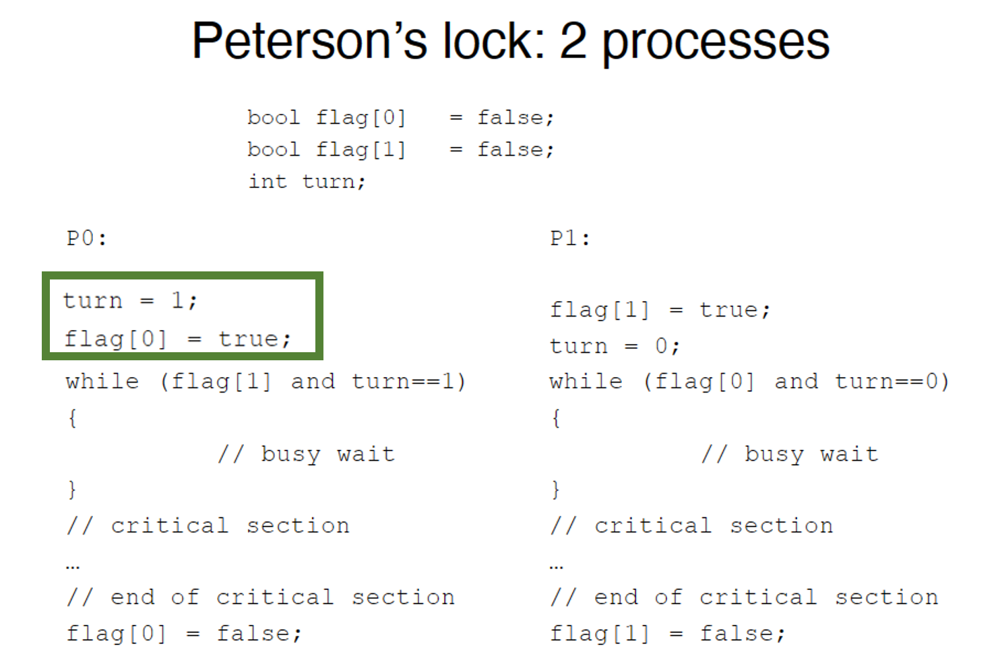
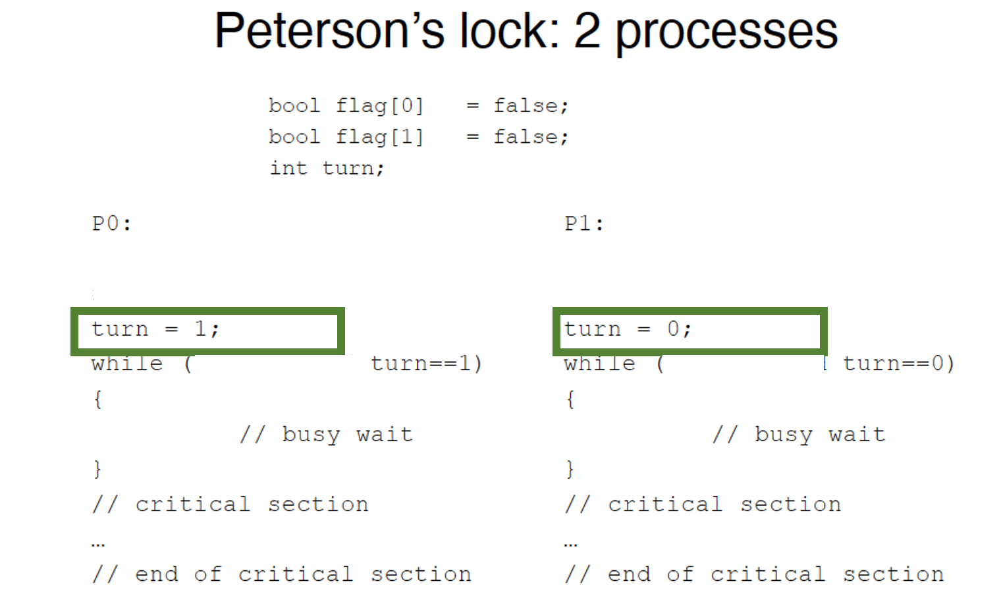

# Quiz 1
## 1. 
What if we reverse the order of the first two lines in the 2-process Peterson’s algorithm (for one of the processes)? Would it work? What if we get rid of flag variables (only use turn as a shared variable)?

### Answer: 

After reverse the order of the first two lines in the 2-progress Peterson's algorithm for one of the progress, for example, I change the P0.

&nbsp; • If P0 first goes into the while{} function, then both P0 and P1 can work;

&nbsp; • If P1 first goes into the while{} function, P1 will never goes into while{} and works the critical section.

If we only use turn as the variable. Then there will be one process works, and another process get stuck in the while{}.

For this part, please read the book "The Art of Multiprocessor Programming"